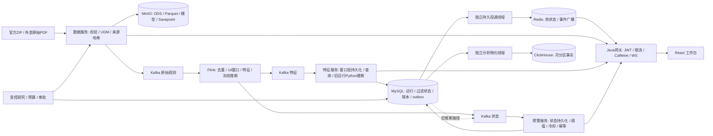
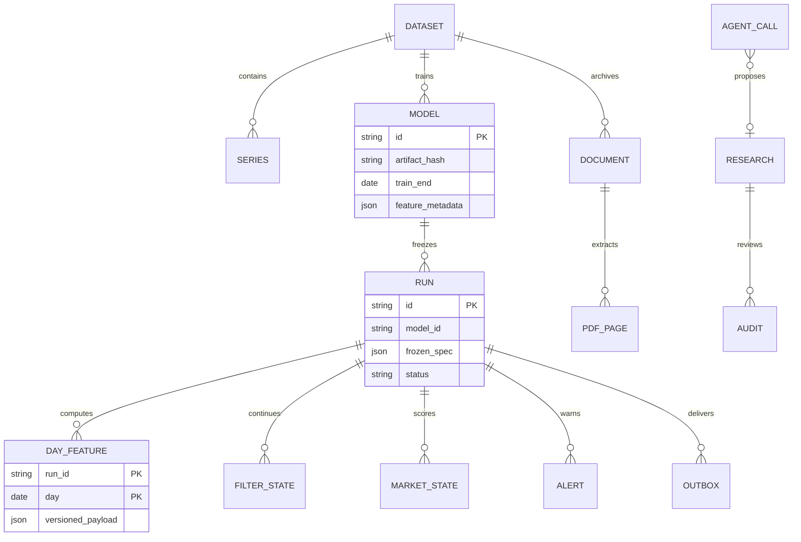

# 架构、血缘与数据关系

此文中的进程、数据库和路径对应实际部署；物化层为最终一致。

```mermaid
flowchart LR
    A[官方ZIP / 外部原始PDF] --> B[数据服务: 校验 / UDM / 来源哈希]
    B --> C[(MinIO: ODS / Parquet / 模型 / Savepoint)]
    B --> D[Kafka 原始观测]
    D --> E[Flink: 去重 / 1d窗口 / 特征 / 冻结推断]
    E --> F[Kafka 特征]
    F --> G[特征服务: 窗口批持久化 / 查询 / 旧运行Python推断]
    G --> H[(MySQL: 运行 / 过滤状态 / 版本 / outbox)]
    E --> I[Kafka 状态]
    H -.旧推断路径.-> I
    I --> J[预警服务: 状态持久化 / 阈值 / 冷却 / 幂等]
    J --> H
    H --> K[独立持久投递线程]
    K --> L[(Redis: 热状态 / 事件广播)]
    H --> M[独立分析物化线程]
    M --> N[(ClickHouse: 月分区事实)]
    L --> O[Java网关: JWT / 限流 / Caffeine / WS]
    B --> O
    G --> O
    J --> O
    O --> P[React 工作台]
    Q[受控研究 / 预算 / 审批] --> B
    Q --> H
```

```mermaid
erDiagram
    DATASET ||--o{ SERIES : contains
    DATASET ||--o{ DOCUMENT : archives
    DATASET ||--o{ MODEL : trains
    MODEL ||--o{ RUN : freezes
    RUN ||--o{ DAY_FEATURE : computes
    RUN ||--o{ FILTER_STATE : continues
    RUN ||--o{ MARKET_STATE : scores
    RUN ||--o{ ALERT : warns
    DOCUMENT ||--o{ PDF_PAGE : extracts
    RESEARCH ||--o{ AUDIT : reviews
    AGENT_CALL }o--o| RESEARCH : proposes
    RUN ||--o{ OUTBOX : delivers
    DAY_FEATURE {
      string run_id PK
      date day PK
      json versioned_payload
    }
    MODEL {
      string id PK
      string artifact_hash
      date train_end
      json feature_metadata
    }
    RUN {
      string id PK
      string model_id
      json frozen_spec
      string status
    }
```

数据库实体分布：赛事运行、结果、过滤状态和投递主事务在MySQL；文档/模型本地目录与离线参照在SQLite，原件/模型/检查点在MinIO，分析事实在ClickHouse，热状态可从主库重建。上述关系是领域关系，不宣称跨数据库外键约束。
